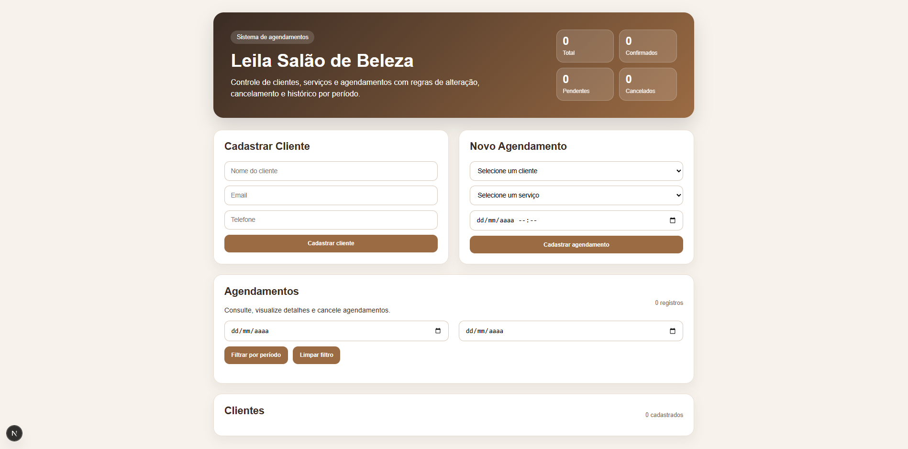
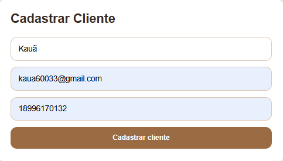
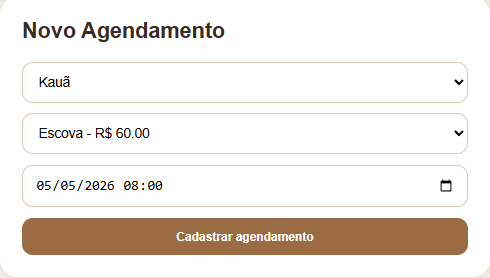
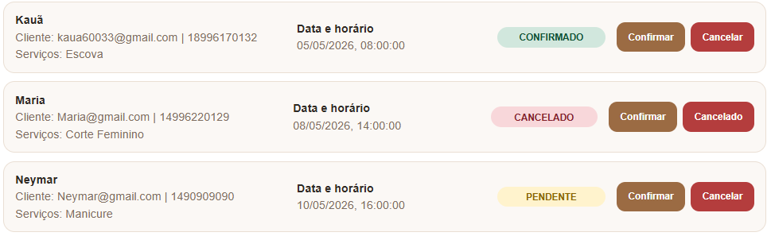
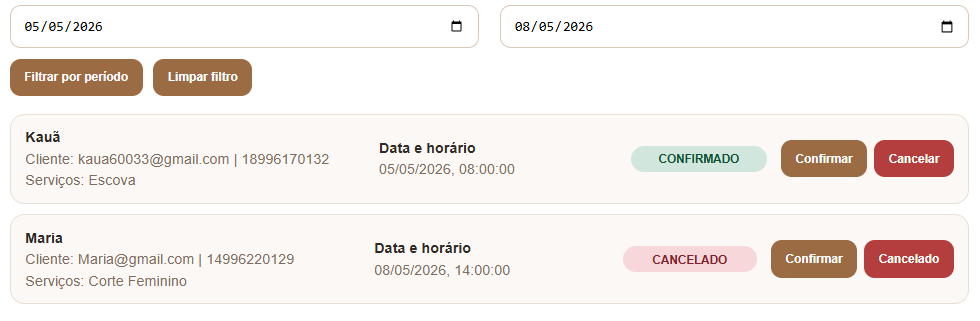
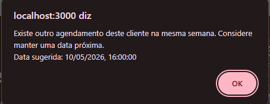

# 💇‍♀️ Sistema de Agendamento - Salão de Beleza

Projeto desenvolvido como teste técnico para vaga de desenvolvedor, simulando um sistema real de gestão de um salão de beleza.

---

## 🚀 Tecnologias utilizadas

- Node.js
- Fastify
- Prisma ORM
- PostgreSQL (Neon)
- Next.js
- TypeScript

---

## 📦 Funcionalidades

### 👤 Clientes

- Criar cliente
- Listar clientes
- Atualizar cliente
- Deletar cliente

### 💅 Serviços

- Criar serviço
- Listar serviços
- Deletar serviço

### 📅 Agendamentos

- Criar agendamento com múltiplos serviços
- Listar agendamentos
- Filtrar por período
- Alterar agendamento até 2 dias antes
- Cancelar agendamento até 2 dias antes
- Confirmar agendamento

---

## ⚙️ Regras de negócio

- Não é possível alterar ou cancelar com menos de 2 dias de antecedência
- Não permite agendamentos no mesmo horário
- Sugere agendamento baseado no histórico do cliente
- Status do agendamento:
  - PENDENTE
  - CONFIRMADO
  - CANCELADO

---

## 📊 Diferenciais implementados

- Bloqueio de conflitos de horário
- Sugestão inteligente de agendamento
- Dashboard com resumo do salão
- Interface moderna e responsiva
- Separação entre backend e frontend

---

## ▶️ Como rodar o projeto

### Backend

cd backend  
npm install  
npm run dev  

Servidor:  
http://localhost:3333  

---

### Frontend

cd frontend  
npm install  
npm run dev  

Aplicação:  
http://localhost:3000  

---

## 🗄️ Banco de dados

Banco PostgreSQL hospedado no Neon.

Para sincronizar o banco:

npx prisma migrate dev  

Para resetar o banco:

npx prisma migrate reset  

---

## 📸 Prints do sistema

---

## 🎥 Vídeo de demonstração

(https://youtu.be/-QFmm5DSkKg)

---

## 👨‍💻 Autor

Kauã Aparecido da Silva